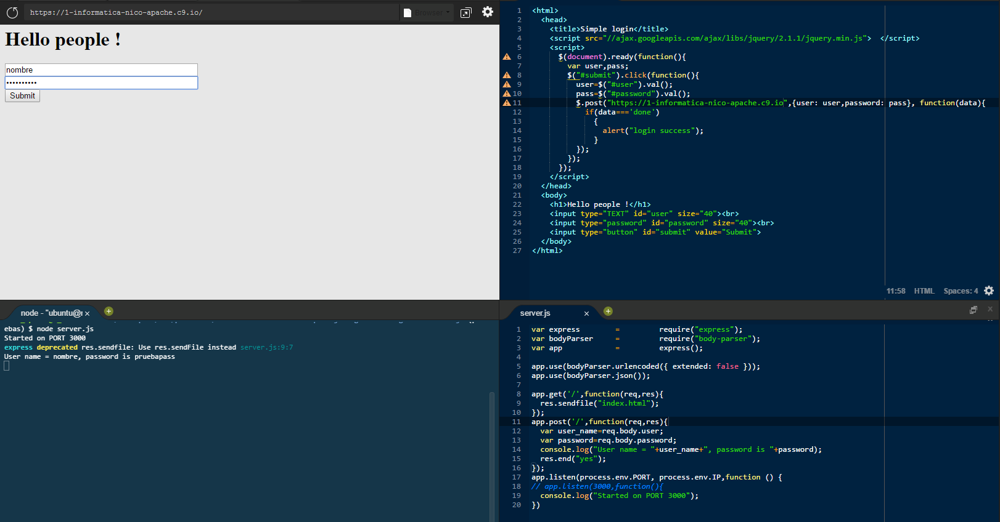

#Direccionamiento básico

El direccionamiento hace referencia a la determinación de cómo una aplicación responde a una solicitud de cliente en un determinado punto final, el cual es una vía de acceso (o un URI, un identificador de recursos uniforme) y un método de solicitud HTTP específico (como GET o POST).

Cada ruta puede tener una o más funciones de manejador, que se excluyen cuando se correlaciona la ruta.

La definición de una ruta tiene la siguiente estructura:

**app.METHOD(PATH, HANDLER)**

Donde

* _appes_ una instancia de express
* METHOD is una método de petición HTTP, en minúscula.
* PATH is un path en el servidor.
* HANDLER es la función ejecutada cuando la ruta es combinada.
* A continuación, se mostrarán unos ejemplos de la definición de rutas simples:

1º Esta función responde con Hello World! en la página de inicio.

**app.get('/'. function (req, res){**

**res.send\('Hello World!\)**

**});**

2º Esta función responde a la solicitud POST en la ruta raíz (/), la página de inicio de la aplicación:

**app.put('/user', function (req, res) {**

**res.send('Got a PUT request at /user');**

**});**

Aquí un ejemplo en la terminal:

##Método POST

Instalar body-parser para poder utilizar el método POST.

**npm install --save body-parser**

3º Esta función responde a la solicitud DELETE en la ruta /user:

**app.delete('/user', function (req, res) {**

**res.send('Got a DELETE request at /user');**

**});**